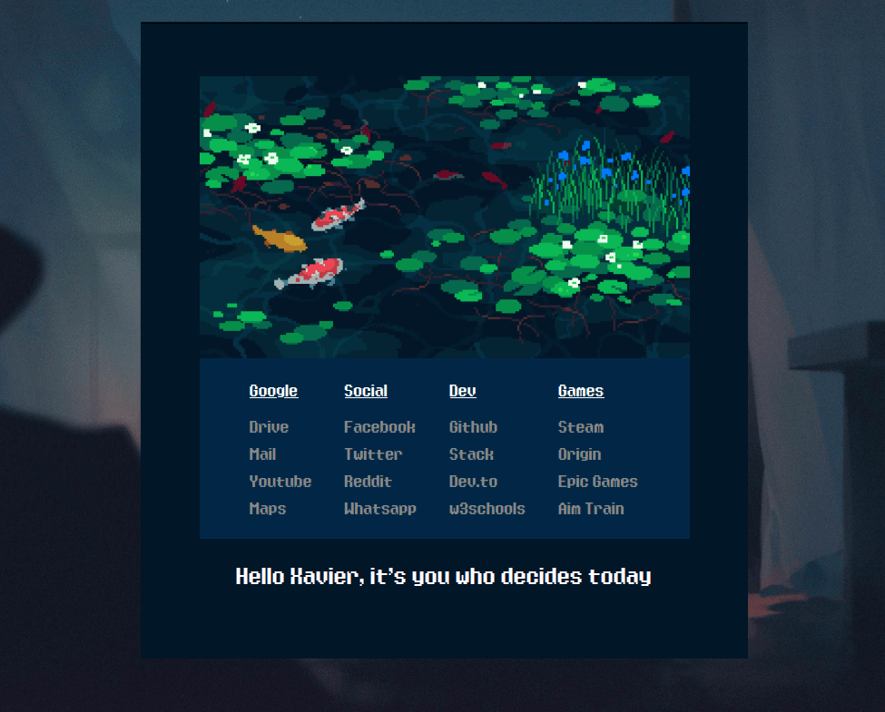
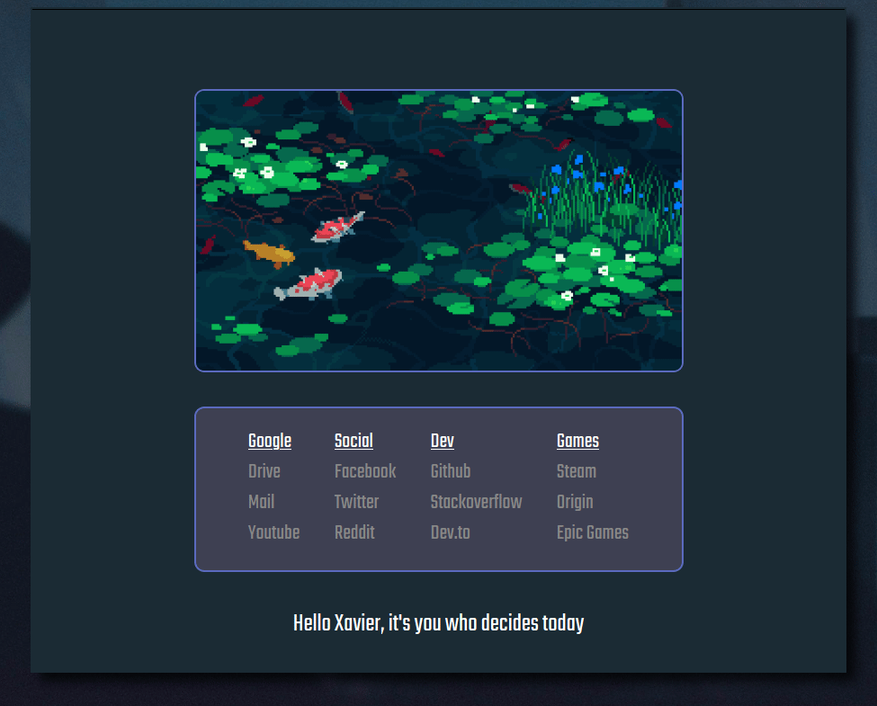

# Simple Startpage

This is my attempt at creating a simple, lightweight and JavaScript-free startpage after checking our [r/startpages][3].

I added a GIF to give it a peaceful but retro ambience.

## Versions

I frequently change my startpage to match my system theme.
You can download particular versions if you want to

* [Version 1][7] - This was showcased on [r/startpages][5]
* [Version 2][8] - New color scheme with a rearranged repo structure

## Installation

1. Clone/download repository in anyplace.
I placed it on my Raspberry Pi, thus the startpage can be accessed by multiple devices.
2. Navigate to `src` directory.
Host the directory using any http server.
I use `python3`'s built-in http server like this

		python3 -m http.server <port> 

3. Open your browser of choice.
I use Firefox.
4. Set homepage as `http://<server IP>:<port>/start.html` in **Settings**

### Set the startpage as the new tab

Firefox does not allow custom new tab by default.
You need an extension for this to work.

1. Download [New Tab Override][1]
2. Open the extension
3. Set options as **custom URL**
4. Set URL as `http://<server IP>:<port>/start.html` like before

**Note:** For Chrome/Chromium, you can use [Custom New Tab URL][6]

## Customization

The color scheme can be easily customized by editing `style.css` file.
I've set all the color codes at the top of the file so that you don't have to hunt them in the file.

If you are going to use more than 3 rows of links in the startpage, consider adjusting

	.content height

## Note

* [Image source][2]
* Font name - Eight Bit Dragon by [Chequered Ink][4]

---

[1]: https://addons.mozilla.org/en-US/firefox/addon/new-tab-override/
[2]: https://1041uuu.tumblr.com/
[3]: https://reddit.com/r/startpages
[4]: https://chequered.ink
[5]: https://www.reddit.com/r/startpages/comments/id5qvh/not_very_original_but_its_mine/
[6]: https://chrome.google.com/webstore/detail/custom-new-tab-url/mmjbdbjnoablegbkcklggeknkfcjkjia
[7]: https://github.com/thexavier666/simple_startpage/tree/77ff07c171e45b5ca37ca92ad8a99caea88b532d
[8]: https://github.com/thexavier666/simple_startpage/tree/a35fe7102c78d75506f613594641a40a398a5a30
